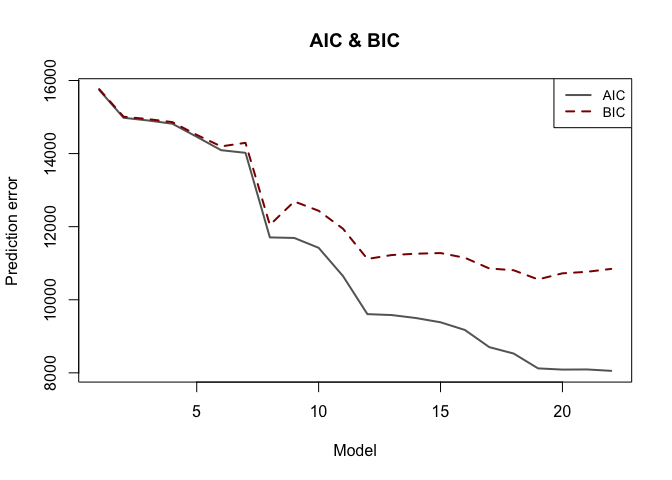
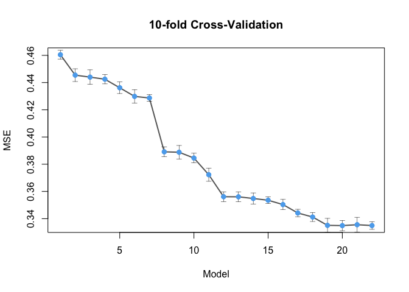

```r
library(Hmisc)
```

```
## Loading required package: lattice
```

```
## Loading required package: survival
```

```
## Loading required package: Formula
```

```
## Loading required package: ggplot2
```

```
## 
## Attaching package: 'Hmisc'
```

```
## The following objects are masked from 'package:base':
## 
##     format.pval, units
```


```r
cross_validate <- function(formula, data, k=10) {
  
  n_folds <- 10
  n_test <- floor(dim(data)[1] * 0.2)
  n_train <- dim(data)[1] - n_test
  
  folds_i <- sample(rep(1:n_folds, length.out = n_train))
  cv_tmp <- matrix(NA, nrow = n_folds, ncol = length(df))
  
  for (k in 1:n_folds) {
    test_i <- which(folds_i == k)
    train_xy <- data[-test_i, ]
    test_xy <- data[test_i, ]
    fitted_model <- lm(formula, data=train_xy)
    pred <- predict(fitted_model, newdata = test_xy)
    cv_tmp[k, ] <- sqrt(mean((pred - test_xy$TOTALDOL.log)^2))
  }
  
  cv_tmp
  
}
```


```r
energy <- read.csv('../../data/recs2009_public_vlad_clean.csv')
```


```r
energy <- energy[-which(energy$FUELPOOL == 21), ]
energy <- energy[-which(energy$PELLIGHT == -2), ]
energy <- energy[-which(energy$AGEHHMEMCAT5 == 18), ]
energy <- energy[-which(energy$TYPERFR2 == 5), ]
```


```r
energy$TOTSQFT.log <- log(1 + energy$TOTSQFT)
energy$TOTALDOL.log <- log(1 + energy$TOTALDOL)
energy$NUMCFAN_log <- log(1 + energy$NUMCFAN)
energy$WINDOWS.f <- factor(energy$WINDOWS)
energy$MONEYPY.f <- factor(energy$MONEYPY)
energy$REPORTABLE_DOMAIN.f <- factor(energy$REPORTABLE_DOMAIN)
energy$DIVISION.f <- factor(energy$DIVISION)
energy$YEARMADE.f <- factor(energy$YEARMADE)
energy$POOL.f <- factor(energy$POOL)
energy$AGEHHMEMCAT2.f <- factor(energy$AGEHHMEMCAT2)
energy$STUDIO.f <- factor(energy$STUDIO)
energy$AGEHHMEMCAT3.f <- factor(energy$AGEHHMEMCAT3)
energy$REPORTABLE_DOMAIN.f <- factor(energy$REPORTABLE_DOMAIN)
energy$LPGDELV.f <- factor(energy$LPGDELV)
energy$PUGCOOK.f <- factor(energy$PUGCOOK)
energy$SWIMPOOL.f <- factor(energy$SWIMPOOL)
energy$USECENAC.f <- factor(energy$USECENAC)
energy$PCSLEEP2.f <- factor(energy$PCSLEEP2)
energy$STORIES.f <- factor(energy$STORIES)
energy$AGEHHMEMCAT4.f <- factor(energy$AGEHHMEMCAT4)
energy$ROOFTYPE.f <- factor(energy$ROOFTYPE)
energy$FUELPOOL.f <- factor(energy$FUELPOOL)
energy$USECFAN.f <- factor(energy$USECFAN)
energy$INSTLWS.f <- factor(energy$INSTLWS)
energy$TIMEON2.f <- factor(energy$TIMEON2)
energy$OVENUSE.f <- factor(energy$OVENUSE)
energy$SIZRFRI2.f <- factor(energy$SIZRFRI2)
energy$OVENFUEL.f <- factor(energy$OVENFUEL)
energy$WHEATSIZ2.f <- factor(energy$WHEATSIZ2)
energy$WASHLOAD.f <- factor(energy$WASHLOAD)
energy$REGIONC.f <- factor(energy$REGIONC)
energy$PCTYPE3.f <- factor(energy$PCTYPE3)
energy$FUELHEAT.f <- factor(energy$FUELHEAT)
energy$REFRIGT2.f <- factor(energy$REFRIGT2)
energy$BATTOOLS.f <- factor(energy$BATTOOLS)
energy$EDUCATION.f <- factor(energy$EDUCATION)
energy$AIA_Zone.f <- factor(energy$AIA_Zone)
energy$PERIODLP.f <- factor(energy$PERIODLP)
energy$COMBODVR3.f <- factor(energy$COMBODVR3)
energy$TVONWE3.f <- factor(energy$TVONWE3)
energy$DRAFTY.f <- factor(energy$DRAFTY)
energy$DWASHUSE.f <- factor(energy$DWASHUSE)
energy$PELLIGHT.f <- factor(energy$PELLIGHT)
energy$SIZRFRI3.f <- factor(energy$SIZRFRI3)
energy$WHEATAGE2.f <- factor(energy$WHEATAGE2)
energy$DRYRUSE.f <- factor(energy$DRYRUSE)
energy$AGECDRYER.f <- factor(energy$AGECDRYER)
energy$TYPEHUQ.f <- factor(energy$TYPEHUQ)
energy$TYPECLN.f <- factor(energy$TYPECLN)
energy$PELHOTWA.f <- factor(energy$PELHOTWA)
energy$ESFRIG.f <- factor(energy$ESFRIG)
energy$AGEHHMEMCAT5.f <- factor(energy$AGEHHMEMCAT5)
energy$YEARMADERANGE.f <- factor(energy$YEARMADERANGE)
energy$AGERFRI2.f <- factor(energy$AGERFRI2)
energy$TYPERFR2.f <- factor(energy$TYPERFR2)
energy$AMTMICRO.f <- factor(energy$AMTMICRO)
energy$WWACAGE.f <- factor(energy$WWACAGE)
energy$LPWATER.f <- factor(energy$LPWATER)
```


```r
models <- list(
  TOTALDOL.log ~ TOTSQFT.log,
  TOTALDOL.log ~ TOTSQFT.log + HEATROOM,
  TOTALDOL.log ~ TOTSQFT.log + HEATROOM + TOTROOMS,
  TOTALDOL.log ~ TOTSQFT.log + HEATROOM + TOTROOMS + NUMCFAN_log,
  TOTALDOL.log ~ TOTSQFT.log + HEATROOM + TOTROOMS + NUMCFAN_log + TVCOLOR,
  TOTALDOL.log ~ TOTSQFT.log + HEATROOM + TOTROOMS + NUMCFAN_log + TVCOLOR + WINDOWS.f,
  TOTALDOL.log ~ TOTSQFT.log + HEATROOM + TOTROOMS + NUMCFAN_log + TVCOLOR + WINDOWS.f + MONEYPY.f,
  TOTALDOL.log ~ TOTSQFT.log + HEATROOM + TOTROOMS + NUMCFAN_log + TVCOLOR + WINDOWS.f + MONEYPY.f + DIVISION.f,
  TOTALDOL.log ~ TOTSQFT.log + HEATROOM + TOTROOMS + NUMCFAN_log + TVCOLOR + WINDOWS.f + MONEYPY.f + DIVISION.f + YEARMADE.f,
  TOTALDOL.log ~ TOTSQFT.log + HEATROOM + TOTROOMS + NUMCFAN_log + TVCOLOR + WINDOWS.f + MONEYPY.f + DIVISION.f + YEARMADE.f + POOL.f,
  TOTALDOL.log ~ TOTSQFT.log + HEATROOM + TOTROOMS + NUMCFAN_log + TVCOLOR + WINDOWS.f + MONEYPY.f + DIVISION.f + YEARMADE.f + POOL.f + AGEHHMEMCAT2.f + STUDIO.f + AGEHHMEMCAT3.f,
  TOTALDOL.log ~ TOTSQFT.log + HEATROOM + TOTROOMS + NUMCFAN_log + TVCOLOR + WINDOWS.f + MONEYPY.f + DIVISION.f + YEARMADE.f + POOL.f + AGEHHMEMCAT2.f + STUDIO.f + AGEHHMEMCAT3.f + REPORTABLE_DOMAIN.f + LPGDELV.f + PUGCOOK.f + SWIMPOOL.f + USECENAC.f + PCSLEEP2.f,
  TOTALDOL.log ~ TOTSQFT.log + HEATROOM + TOTROOMS + NUMCFAN_log + TVCOLOR + WINDOWS.f + MONEYPY.f + DIVISION.f + YEARMADE.f + POOL.f + AGEHHMEMCAT2.f + STUDIO.f + AGEHHMEMCAT3.f + REPORTABLE_DOMAIN.f + LPGDELV.f + PUGCOOK.f + SWIMPOOL.f + USECENAC.f + PCSLEEP2.f + STORIES.f + AGEHHMEMCAT4.f,
   TOTALDOL.log ~ TOTSQFT.log + HEATROOM + TOTROOMS + NUMCFAN_log + TVCOLOR + WINDOWS.f + MONEYPY.f + DIVISION.f + YEARMADE.f + POOL.f + AGEHHMEMCAT2.f + STUDIO.f + AGEHHMEMCAT3.f + REPORTABLE_DOMAIN.f + LPGDELV.f + PUGCOOK.f + SWIMPOOL.f + USECENAC.f + PCSLEEP2.f + STORIES.f + AGEHHMEMCAT4.f + ROOFTYPE.f + FUELPOOL.f + USECFAN.f,
  TOTALDOL.log ~ TOTSQFT.log + HEATROOM + TOTROOMS + NUMCFAN_log + TVCOLOR + WINDOWS.f + MONEYPY.f + DIVISION.f + YEARMADE.f + POOL.f + AGEHHMEMCAT2.f + STUDIO.f + AGEHHMEMCAT3.f + REPORTABLE_DOMAIN.f + LPGDELV.f + PUGCOOK.f + SWIMPOOL.f + USECENAC.f + PCSLEEP2.f + STORIES.f + AGEHHMEMCAT4.f + ROOFTYPE.f + FUELPOOL.f + USECFAN.f + INSTLWS.f + TIMEON2.f + OVENUSE.f + SIZRFRI2.f,
  TOTALDOL.log ~ TOTSQFT.log + HEATROOM + TOTROOMS + NUMCFAN_log + TVCOLOR + WINDOWS.f + MONEYPY.f + DIVISION.f + YEARMADE.f + POOL.f + AGEHHMEMCAT2.f + STUDIO.f + AGEHHMEMCAT3.f + REPORTABLE_DOMAIN.f + LPGDELV.f + PUGCOOK.f + SWIMPOOL.f + USECENAC.f + PCSLEEP2.f + STORIES.f + AGEHHMEMCAT4.f + ROOFTYPE.f + FUELPOOL.f + USECFAN.f + INSTLWS.f + TIMEON2.f + OVENUSE.f + SIZRFRI2.f + OVENFUEL.f + WHEATSIZ2.f + WASHLOAD.f + REGIONC.f,
  TOTALDOL.log ~ TOTSQFT.log + HEATROOM + TOTROOMS + NUMCFAN_log + TVCOLOR + WINDOWS.f + MONEYPY.f + DIVISION.f + YEARMADE.f + POOL.f + AGEHHMEMCAT2.f + STUDIO.f + AGEHHMEMCAT3.f + REPORTABLE_DOMAIN.f + LPGDELV.f + PUGCOOK.f + SWIMPOOL.f + USECENAC.f + PCSLEEP2.f + STORIES.f + AGEHHMEMCAT4.f + ROOFTYPE.f + FUELPOOL.f + USECFAN.f + INSTLWS.f + TIMEON2.f + OVENUSE.f + SIZRFRI2.f + OVENFUEL.f + WHEATSIZ2.f + WASHLOAD.f + REGIONC.f + PCTYPE3.f + FUELHEAT.f + REFRIGT2.f + BATTOOLS.f + EDUCATION.f,
  TOTALDOL.log ~ TOTSQFT.log + HEATROOM + TOTROOMS + NUMCFAN_log + TVCOLOR + WINDOWS.f + MONEYPY.f + DIVISION.f + YEARMADE.f + POOL.f + AGEHHMEMCAT2.f + STUDIO.f + AGEHHMEMCAT3.f + REPORTABLE_DOMAIN.f + LPGDELV.f + PUGCOOK.f + SWIMPOOL.f + USECENAC.f + PCSLEEP2.f + STORIES.f + AGEHHMEMCAT4.f + ROOFTYPE.f + FUELPOOL.f + USECFAN.f + INSTLWS.f + TIMEON2.f + OVENUSE.f + SIZRFRI2.f + OVENFUEL.f + WHEATSIZ2.f + WASHLOAD.f + REGIONC.f + PCTYPE3.f + FUELHEAT.f + REFRIGT2.f + BATTOOLS.f + EDUCATION.f + AIA_Zone.f + PERIODLP.f + COMBODVR3.f + TVONWE3.f + DRAFTY.f,
  TOTALDOL.log ~ TOTSQFT.log + HEATROOM + TOTROOMS + NUMCFAN_log + TVCOLOR + WINDOWS.f + MONEYPY.f + DIVISION.f + YEARMADE.f + POOL.f + AGEHHMEMCAT2.f + STUDIO.f + AGEHHMEMCAT3.f + REPORTABLE_DOMAIN.f + LPGDELV.f + PUGCOOK.f + SWIMPOOL.f + USECENAC.f + PCSLEEP2.f + STORIES.f + AGEHHMEMCAT4.f + ROOFTYPE.f + FUELPOOL.f + USECFAN.f + INSTLWS.f + TIMEON2.f + OVENUSE.f + SIZRFRI2.f + OVENFUEL.f + WHEATSIZ2.f + WASHLOAD.f + REGIONC.f + PCTYPE3.f + FUELHEAT.f + REFRIGT2.f + BATTOOLS.f + EDUCATION.f + AIA_Zone.f + PERIODLP.f + COMBODVR3.f + TVONWE3.f + DRAFTY.f + DWASHUSE.f + PELLIGHT.f + SIZRFRI3.f + WHEATAGE2.f + DRYRUSE.f,
  TOTALDOL.log ~ TOTSQFT.log + HEATROOM + TOTROOMS + NUMCFAN_log + TVCOLOR + WINDOWS.f + MONEYPY.f + DIVISION.f + YEARMADE.f + POOL.f + AGEHHMEMCAT2.f + STUDIO.f + AGEHHMEMCAT3.f + REPORTABLE_DOMAIN.f + LPGDELV.f + PUGCOOK.f + SWIMPOOL.f + USECENAC.f + PCSLEEP2.f + STORIES.f + AGEHHMEMCAT4.f + ROOFTYPE.f + FUELPOOL.f + USECFAN.f + INSTLWS.f + TIMEON2.f + OVENUSE.f + SIZRFRI2.f + OVENFUEL.f + WHEATSIZ2.f + WASHLOAD.f + REGIONC.f + PCTYPE3.f + FUELHEAT.f + REFRIGT2.f + BATTOOLS.f + EDUCATION.f + AIA_Zone.f + PERIODLP.f + COMBODVR3.f + TVONWE3.f + DRAFTY.f + DWASHUSE.f + PELLIGHT.f + SIZRFRI3.f + WHEATAGE2.f + DRYRUSE.f + AGECDRYER.f + TYPEHUQ.f + TYPECLN.f + PELHOTWA.f + ESFRIG.f + AGEHHMEMCAT5.f,
  TOTALDOL.log ~ TOTSQFT.log + HEATROOM + TOTROOMS + NUMCFAN_log + TVCOLOR + WINDOWS.f + MONEYPY.f + DIVISION.f + YEARMADE.f + POOL.f + AGEHHMEMCAT2.f + STUDIO.f + AGEHHMEMCAT3.f + REPORTABLE_DOMAIN.f + LPGDELV.f + PUGCOOK.f + SWIMPOOL.f + USECENAC.f + PCSLEEP2.f + STORIES.f + AGEHHMEMCAT4.f + ROOFTYPE.f + FUELPOOL.f + USECFAN.f + INSTLWS.f + TIMEON2.f + OVENUSE.f + SIZRFRI2.f + OVENFUEL.f + WHEATSIZ2.f + WASHLOAD.f + REGIONC.f + PCTYPE3.f + FUELHEAT.f + REFRIGT2.f + BATTOOLS.f + EDUCATION.f + AIA_Zone.f + PERIODLP.f + COMBODVR3.f + TVONWE3.f + DRAFTY.f + DWASHUSE.f + PELLIGHT.f + SIZRFRI3.f + WHEATAGE2.f + DRYRUSE.f + AGECDRYER.f + TYPEHUQ.f + TYPECLN.f + PELHOTWA.f + ESFRIG.f + AGEHHMEMCAT5.f + YEARMADERANGE.f + AGERFRI2.f,     TOTALDOL.log ~ TOTSQFT.log + HEATROOM + TOTROOMS + NUMCFAN_log + TVCOLOR + WINDOWS.f + MONEYPY.f + DIVISION.f + YEARMADE.f + POOL.f + AGEHHMEMCAT2.f + STUDIO.f + AGEHHMEMCAT3.f + REPORTABLE_DOMAIN.f + LPGDELV.f + PUGCOOK.f + SWIMPOOL.f + USECENAC.f + PCSLEEP2.f + STORIES.f + AGEHHMEMCAT4.f + ROOFTYPE.f + FUELPOOL.f + USECFAN.f + INSTLWS.f + TIMEON2.f + OVENUSE.f + SIZRFRI2.f + OVENFUEL.f + WHEATSIZ2.f + WASHLOAD.f + REGIONC.f + PCTYPE3.f + FUELHEAT.f + REFRIGT2.f + BATTOOLS.f + EDUCATION.f + AIA_Zone.f + PERIODLP.f + COMBODVR3.f + TVONWE3.f + DRAFTY.f + DWASHUSE.f + PELLIGHT.f + SIZRFRI3.f + WHEATAGE2.f + DRYRUSE.f + AGECDRYER.f + TYPEHUQ.f + TYPECLN.f + PELHOTWA.f + ESFRIG.f + AGEHHMEMCAT5.f + YEARMADERANGE.f + AGERFRI2.f + TYPERFR2.f + AMTMICRO.f + WWACAGE.f + LPWATER.f
)
```


```r
cv_all <- sapply(models, function(x) cross_validate(x, data = energy))
```

```
## Warning in predict.lm(fitted_model, newdata = test_xy): prediction from a
## rank-deficient fit may be misleading

## Warning in predict.lm(fitted_model, newdata = test_xy): prediction from a
## rank-deficient fit may be misleading

## Warning in predict.lm(fitted_model, newdata = test_xy): prediction from a
## rank-deficient fit may be misleading

## Warning in predict.lm(fitted_model, newdata = test_xy): prediction from a
## rank-deficient fit may be misleading

## Warning in predict.lm(fitted_model, newdata = test_xy): prediction from a
## rank-deficient fit may be misleading

## Warning in predict.lm(fitted_model, newdata = test_xy): prediction from a
## rank-deficient fit may be misleading

## Warning in predict.lm(fitted_model, newdata = test_xy): prediction from a
## rank-deficient fit may be misleading

## Warning in predict.lm(fitted_model, newdata = test_xy): prediction from a
## rank-deficient fit may be misleading

## Warning in predict.lm(fitted_model, newdata = test_xy): prediction from a
## rank-deficient fit may be misleading

## Warning in predict.lm(fitted_model, newdata = test_xy): prediction from a
## rank-deficient fit may be misleading

## Warning in predict.lm(fitted_model, newdata = test_xy): prediction from a
## rank-deficient fit may be misleading

## Warning in predict.lm(fitted_model, newdata = test_xy): prediction from a
## rank-deficient fit may be misleading

## Warning in predict.lm(fitted_model, newdata = test_xy): prediction from a
## rank-deficient fit may be misleading

## Warning in predict.lm(fitted_model, newdata = test_xy): prediction from a
## rank-deficient fit may be misleading

## Warning in predict.lm(fitted_model, newdata = test_xy): prediction from a
## rank-deficient fit may be misleading

## Warning in predict.lm(fitted_model, newdata = test_xy): prediction from a
## rank-deficient fit may be misleading

## Warning in predict.lm(fitted_model, newdata = test_xy): prediction from a
## rank-deficient fit may be misleading

## Warning in predict.lm(fitted_model, newdata = test_xy): prediction from a
## rank-deficient fit may be misleading

## Warning in predict.lm(fitted_model, newdata = test_xy): prediction from a
## rank-deficient fit may be misleading

## Warning in predict.lm(fitted_model, newdata = test_xy): prediction from a
## rank-deficient fit may be misleading

## Warning in predict.lm(fitted_model, newdata = test_xy): prediction from a
## rank-deficient fit may be misleading

## Warning in predict.lm(fitted_model, newdata = test_xy): prediction from a
## rank-deficient fit may be misleading

## Warning in predict.lm(fitted_model, newdata = test_xy): prediction from a
## rank-deficient fit may be misleading

## Warning in predict.lm(fitted_model, newdata = test_xy): prediction from a
## rank-deficient fit may be misleading

## Warning in predict.lm(fitted_model, newdata = test_xy): prediction from a
## rank-deficient fit may be misleading

## Warning in predict.lm(fitted_model, newdata = test_xy): prediction from a
## rank-deficient fit may be misleading

## Warning in predict.lm(fitted_model, newdata = test_xy): prediction from a
## rank-deficient fit may be misleading

## Warning in predict.lm(fitted_model, newdata = test_xy): prediction from a
## rank-deficient fit may be misleading

## Warning in predict.lm(fitted_model, newdata = test_xy): prediction from a
## rank-deficient fit may be misleading

## Warning in predict.lm(fitted_model, newdata = test_xy): prediction from a
## rank-deficient fit may be misleading

## Warning in predict.lm(fitted_model, newdata = test_xy): prediction from a
## rank-deficient fit may be misleading

## Warning in predict.lm(fitted_model, newdata = test_xy): prediction from a
## rank-deficient fit may be misleading

## Warning in predict.lm(fitted_model, newdata = test_xy): prediction from a
## rank-deficient fit may be misleading

## Warning in predict.lm(fitted_model, newdata = test_xy): prediction from a
## rank-deficient fit may be misleading

## Warning in predict.lm(fitted_model, newdata = test_xy): prediction from a
## rank-deficient fit may be misleading

## Warning in predict.lm(fitted_model, newdata = test_xy): prediction from a
## rank-deficient fit may be misleading

## Warning in predict.lm(fitted_model, newdata = test_xy): prediction from a
## rank-deficient fit may be misleading

## Warning in predict.lm(fitted_model, newdata = test_xy): prediction from a
## rank-deficient fit may be misleading

## Warning in predict.lm(fitted_model, newdata = test_xy): prediction from a
## rank-deficient fit may be misleading

## Warning in predict.lm(fitted_model, newdata = test_xy): prediction from a
## rank-deficient fit may be misleading

## Warning in predict.lm(fitted_model, newdata = test_xy): prediction from a
## rank-deficient fit may be misleading

## Warning in predict.lm(fitted_model, newdata = test_xy): prediction from a
## rank-deficient fit may be misleading

## Warning in predict.lm(fitted_model, newdata = test_xy): prediction from a
## rank-deficient fit may be misleading

## Warning in predict.lm(fitted_model, newdata = test_xy): prediction from a
## rank-deficient fit may be misleading

## Warning in predict.lm(fitted_model, newdata = test_xy): prediction from a
## rank-deficient fit may be misleading

## Warning in predict.lm(fitted_model, newdata = test_xy): prediction from a
## rank-deficient fit may be misleading

## Warning in predict.lm(fitted_model, newdata = test_xy): prediction from a
## rank-deficient fit may be misleading

## Warning in predict.lm(fitted_model, newdata = test_xy): prediction from a
## rank-deficient fit may be misleading

## Warning in predict.lm(fitted_model, newdata = test_xy): prediction from a
## rank-deficient fit may be misleading

## Warning in predict.lm(fitted_model, newdata = test_xy): prediction from a
## rank-deficient fit may be misleading

## Warning in predict.lm(fitted_model, newdata = test_xy): prediction from a
## rank-deficient fit may be misleading

## Warning in predict.lm(fitted_model, newdata = test_xy): prediction from a
## rank-deficient fit may be misleading

## Warning in predict.lm(fitted_model, newdata = test_xy): prediction from a
## rank-deficient fit may be misleading

## Warning in predict.lm(fitted_model, newdata = test_xy): prediction from a
## rank-deficient fit may be misleading

## Warning in predict.lm(fitted_model, newdata = test_xy): prediction from a
## rank-deficient fit may be misleading

## Warning in predict.lm(fitted_model, newdata = test_xy): prediction from a
## rank-deficient fit may be misleading

## Warning in predict.lm(fitted_model, newdata = test_xy): prediction from a
## rank-deficient fit may be misleading

## Warning in predict.lm(fitted_model, newdata = test_xy): prediction from a
## rank-deficient fit may be misleading

## Warning in predict.lm(fitted_model, newdata = test_xy): prediction from a
## rank-deficient fit may be misleading

## Warning in predict.lm(fitted_model, newdata = test_xy): prediction from a
## rank-deficient fit may be misleading

## Warning in predict.lm(fitted_model, newdata = test_xy): prediction from a
## rank-deficient fit may be misleading

## Warning in predict.lm(fitted_model, newdata = test_xy): prediction from a
## rank-deficient fit may be misleading

## Warning in predict.lm(fitted_model, newdata = test_xy): prediction from a
## rank-deficient fit may be misleading

## Warning in predict.lm(fitted_model, newdata = test_xy): prediction from a
## rank-deficient fit may be misleading

## Warning in predict.lm(fitted_model, newdata = test_xy): prediction from a
## rank-deficient fit may be misleading

## Warning in predict.lm(fitted_model, newdata = test_xy): prediction from a
## rank-deficient fit may be misleading

## Warning in predict.lm(fitted_model, newdata = test_xy): prediction from a
## rank-deficient fit may be misleading

## Warning in predict.lm(fitted_model, newdata = test_xy): prediction from a
## rank-deficient fit may be misleading

## Warning in predict.lm(fitted_model, newdata = test_xy): prediction from a
## rank-deficient fit may be misleading

## Warning in predict.lm(fitted_model, newdata = test_xy): prediction from a
## rank-deficient fit may be misleading

## Warning in predict.lm(fitted_model, newdata = test_xy): prediction from a
## rank-deficient fit may be misleading

## Warning in predict.lm(fitted_model, newdata = test_xy): prediction from a
## rank-deficient fit may be misleading

## Warning in predict.lm(fitted_model, newdata = test_xy): prediction from a
## rank-deficient fit may be misleading

## Warning in predict.lm(fitted_model, newdata = test_xy): prediction from a
## rank-deficient fit may be misleading

## Warning in predict.lm(fitted_model, newdata = test_xy): prediction from a
## rank-deficient fit may be misleading

## Warning in predict.lm(fitted_model, newdata = test_xy): prediction from a
## rank-deficient fit may be misleading

## Warning in predict.lm(fitted_model, newdata = test_xy): prediction from a
## rank-deficient fit may be misleading

## Warning in predict.lm(fitted_model, newdata = test_xy): prediction from a
## rank-deficient fit may be misleading

## Warning in predict.lm(fitted_model, newdata = test_xy): prediction from a
## rank-deficient fit may be misleading

## Warning in predict.lm(fitted_model, newdata = test_xy): prediction from a
## rank-deficient fit may be misleading

## Warning in predict.lm(fitted_model, newdata = test_xy): prediction from a
## rank-deficient fit may be misleading

## Warning in predict.lm(fitted_model, newdata = test_xy): prediction from a
## rank-deficient fit may be misleading

## Warning in predict.lm(fitted_model, newdata = test_xy): prediction from a
## rank-deficient fit may be misleading

## Warning in predict.lm(fitted_model, newdata = test_xy): prediction from a
## rank-deficient fit may be misleading

## Warning in predict.lm(fitted_model, newdata = test_xy): prediction from a
## rank-deficient fit may be misleading

## Warning in predict.lm(fitted_model, newdata = test_xy): prediction from a
## rank-deficient fit may be misleading

## Warning in predict.lm(fitted_model, newdata = test_xy): prediction from a
## rank-deficient fit may be misleading

## Warning in predict.lm(fitted_model, newdata = test_xy): prediction from a
## rank-deficient fit may be misleading

## Warning in predict.lm(fitted_model, newdata = test_xy): prediction from a
## rank-deficient fit may be misleading

## Warning in predict.lm(fitted_model, newdata = test_xy): prediction from a
## rank-deficient fit may be misleading

## Warning in predict.lm(fitted_model, newdata = test_xy): prediction from a
## rank-deficient fit may be misleading

## Warning in predict.lm(fitted_model, newdata = test_xy): prediction from a
## rank-deficient fit may be misleading

## Warning in predict.lm(fitted_model, newdata = test_xy): prediction from a
## rank-deficient fit may be misleading

## Warning in predict.lm(fitted_model, newdata = test_xy): prediction from a
## rank-deficient fit may be misleading

## Warning in predict.lm(fitted_model, newdata = test_xy): prediction from a
## rank-deficient fit may be misleading

## Warning in predict.lm(fitted_model, newdata = test_xy): prediction from a
## rank-deficient fit may be misleading

## Warning in predict.lm(fitted_model, newdata = test_xy): prediction from a
## rank-deficient fit may be misleading

## Warning in predict.lm(fitted_model, newdata = test_xy): prediction from a
## rank-deficient fit may be misleading

## Warning in predict.lm(fitted_model, newdata = test_xy): prediction from a
## rank-deficient fit may be misleading

## Warning in predict.lm(fitted_model, newdata = test_xy): prediction from a
## rank-deficient fit may be misleading

## Warning in predict.lm(fitted_model, newdata = test_xy): prediction from a
## rank-deficient fit may be misleading

## Warning in predict.lm(fitted_model, newdata = test_xy): prediction from a
## rank-deficient fit may be misleading

## Warning in predict.lm(fitted_model, newdata = test_xy): prediction from a
## rank-deficient fit may be misleading

## Warning in predict.lm(fitted_model, newdata = test_xy): prediction from a
## rank-deficient fit may be misleading

## Warning in predict.lm(fitted_model, newdata = test_xy): prediction from a
## rank-deficient fit may be misleading

## Warning in predict.lm(fitted_model, newdata = test_xy): prediction from a
## rank-deficient fit may be misleading

## Warning in predict.lm(fitted_model, newdata = test_xy): prediction from a
## rank-deficient fit may be misleading

## Warning in predict.lm(fitted_model, newdata = test_xy): prediction from a
## rank-deficient fit may be misleading

## Warning in predict.lm(fitted_model, newdata = test_xy): prediction from a
## rank-deficient fit may be misleading

## Warning in predict.lm(fitted_model, newdata = test_xy): prediction from a
## rank-deficient fit may be misleading
```

```r
cv <- colMeans(cv_all)
aic <- sapply(models, function(x) AIC(lm(x, data=energy)))
bic <- sapply(models, function(x) BIC(lm(x, data=energy)))
```


```r
models
```

```
## [[1]]
## TOTALDOL.log ~ TOTSQFT.log
## 
## [[2]]
## TOTALDOL.log ~ TOTSQFT.log + HEATROOM
## 
## [[3]]
## TOTALDOL.log ~ TOTSQFT.log + HEATROOM + TOTROOMS
## 
## [[4]]
## TOTALDOL.log ~ TOTSQFT.log + HEATROOM + TOTROOMS + NUMCFAN_log
## 
## [[5]]
## TOTALDOL.log ~ TOTSQFT.log + HEATROOM + TOTROOMS + NUMCFAN_log + 
##     TVCOLOR
## 
## [[6]]
## TOTALDOL.log ~ TOTSQFT.log + HEATROOM + TOTROOMS + NUMCFAN_log + 
##     TVCOLOR + WINDOWS.f
## 
## [[7]]
## TOTALDOL.log ~ TOTSQFT.log + HEATROOM + TOTROOMS + NUMCFAN_log + 
##     TVCOLOR + WINDOWS.f + MONEYPY.f
## 
## [[8]]
## TOTALDOL.log ~ TOTSQFT.log + HEATROOM + TOTROOMS + NUMCFAN_log + 
##     TVCOLOR + WINDOWS.f + MONEYPY.f + DIVISION.f
## 
## [[9]]
## TOTALDOL.log ~ TOTSQFT.log + HEATROOM + TOTROOMS + NUMCFAN_log + 
##     TVCOLOR + WINDOWS.f + MONEYPY.f + DIVISION.f + YEARMADE.f
## 
## [[10]]
## TOTALDOL.log ~ TOTSQFT.log + HEATROOM + TOTROOMS + NUMCFAN_log + 
##     TVCOLOR + WINDOWS.f + MONEYPY.f + DIVISION.f + YEARMADE.f + 
##     POOL.f
## 
## [[11]]
## TOTALDOL.log ~ TOTSQFT.log + HEATROOM + TOTROOMS + NUMCFAN_log + 
##     TVCOLOR + WINDOWS.f + MONEYPY.f + DIVISION.f + YEARMADE.f + 
##     POOL.f + AGEHHMEMCAT2.f + STUDIO.f + AGEHHMEMCAT3.f
## 
## [[12]]
## TOTALDOL.log ~ TOTSQFT.log + HEATROOM + TOTROOMS + NUMCFAN_log + 
##     TVCOLOR + WINDOWS.f + MONEYPY.f + DIVISION.f + YEARMADE.f + 
##     POOL.f + AGEHHMEMCAT2.f + STUDIO.f + AGEHHMEMCAT3.f + REPORTABLE_DOMAIN.f + 
##     LPGDELV.f + PUGCOOK.f + SWIMPOOL.f + USECENAC.f + PCSLEEP2.f
## 
## [[13]]
## TOTALDOL.log ~ TOTSQFT.log + HEATROOM + TOTROOMS + NUMCFAN_log + 
##     TVCOLOR + WINDOWS.f + MONEYPY.f + DIVISION.f + YEARMADE.f + 
##     POOL.f + AGEHHMEMCAT2.f + STUDIO.f + AGEHHMEMCAT3.f + REPORTABLE_DOMAIN.f + 
##     LPGDELV.f + PUGCOOK.f + SWIMPOOL.f + USECENAC.f + PCSLEEP2.f + 
##     STORIES.f + AGEHHMEMCAT4.f
## 
## [[14]]
## TOTALDOL.log ~ TOTSQFT.log + HEATROOM + TOTROOMS + NUMCFAN_log + 
##     TVCOLOR + WINDOWS.f + MONEYPY.f + DIVISION.f + YEARMADE.f + 
##     POOL.f + AGEHHMEMCAT2.f + STUDIO.f + AGEHHMEMCAT3.f + REPORTABLE_DOMAIN.f + 
##     LPGDELV.f + PUGCOOK.f + SWIMPOOL.f + USECENAC.f + PCSLEEP2.f + 
##     STORIES.f + AGEHHMEMCAT4.f + ROOFTYPE.f + FUELPOOL.f + USECFAN.f
## 
## [[15]]
## TOTALDOL.log ~ TOTSQFT.log + HEATROOM + TOTROOMS + NUMCFAN_log + 
##     TVCOLOR + WINDOWS.f + MONEYPY.f + DIVISION.f + YEARMADE.f + 
##     POOL.f + AGEHHMEMCAT2.f + STUDIO.f + AGEHHMEMCAT3.f + REPORTABLE_DOMAIN.f + 
##     LPGDELV.f + PUGCOOK.f + SWIMPOOL.f + USECENAC.f + PCSLEEP2.f + 
##     STORIES.f + AGEHHMEMCAT4.f + ROOFTYPE.f + FUELPOOL.f + USECFAN.f + 
##     INSTLWS.f + TIMEON2.f + OVENUSE.f + SIZRFRI2.f
## 
## [[16]]
## TOTALDOL.log ~ TOTSQFT.log + HEATROOM + TOTROOMS + NUMCFAN_log + 
##     TVCOLOR + WINDOWS.f + MONEYPY.f + DIVISION.f + YEARMADE.f + 
##     POOL.f + AGEHHMEMCAT2.f + STUDIO.f + AGEHHMEMCAT3.f + REPORTABLE_DOMAIN.f + 
##     LPGDELV.f + PUGCOOK.f + SWIMPOOL.f + USECENAC.f + PCSLEEP2.f + 
##     STORIES.f + AGEHHMEMCAT4.f + ROOFTYPE.f + FUELPOOL.f + USECFAN.f + 
##     INSTLWS.f + TIMEON2.f + OVENUSE.f + SIZRFRI2.f + OVENFUEL.f + 
##     WHEATSIZ2.f + WASHLOAD.f + REGIONC.f
## 
## [[17]]
## TOTALDOL.log ~ TOTSQFT.log + HEATROOM + TOTROOMS + NUMCFAN_log + 
##     TVCOLOR + WINDOWS.f + MONEYPY.f + DIVISION.f + YEARMADE.f + 
##     POOL.f + AGEHHMEMCAT2.f + STUDIO.f + AGEHHMEMCAT3.f + REPORTABLE_DOMAIN.f + 
##     LPGDELV.f + PUGCOOK.f + SWIMPOOL.f + USECENAC.f + PCSLEEP2.f + 
##     STORIES.f + AGEHHMEMCAT4.f + ROOFTYPE.f + FUELPOOL.f + USECFAN.f + 
##     INSTLWS.f + TIMEON2.f + OVENUSE.f + SIZRFRI2.f + OVENFUEL.f + 
##     WHEATSIZ2.f + WASHLOAD.f + REGIONC.f + PCTYPE3.f + FUELHEAT.f + 
##     REFRIGT2.f + BATTOOLS.f + EDUCATION.f
## 
## [[18]]
## TOTALDOL.log ~ TOTSQFT.log + HEATROOM + TOTROOMS + NUMCFAN_log + 
##     TVCOLOR + WINDOWS.f + MONEYPY.f + DIVISION.f + YEARMADE.f + 
##     POOL.f + AGEHHMEMCAT2.f + STUDIO.f + AGEHHMEMCAT3.f + REPORTABLE_DOMAIN.f + 
##     LPGDELV.f + PUGCOOK.f + SWIMPOOL.f + USECENAC.f + PCSLEEP2.f + 
##     STORIES.f + AGEHHMEMCAT4.f + ROOFTYPE.f + FUELPOOL.f + USECFAN.f + 
##     INSTLWS.f + TIMEON2.f + OVENUSE.f + SIZRFRI2.f + OVENFUEL.f + 
##     WHEATSIZ2.f + WASHLOAD.f + REGIONC.f + PCTYPE3.f + FUELHEAT.f + 
##     REFRIGT2.f + BATTOOLS.f + EDUCATION.f + AIA_Zone.f + PERIODLP.f + 
##     COMBODVR3.f + TVONWE3.f + DRAFTY.f
## 
## [[19]]
## TOTALDOL.log ~ TOTSQFT.log + HEATROOM + TOTROOMS + NUMCFAN_log + 
##     TVCOLOR + WINDOWS.f + MONEYPY.f + DIVISION.f + YEARMADE.f + 
##     POOL.f + AGEHHMEMCAT2.f + STUDIO.f + AGEHHMEMCAT3.f + REPORTABLE_DOMAIN.f + 
##     LPGDELV.f + PUGCOOK.f + SWIMPOOL.f + USECENAC.f + PCSLEEP2.f + 
##     STORIES.f + AGEHHMEMCAT4.f + ROOFTYPE.f + FUELPOOL.f + USECFAN.f + 
##     INSTLWS.f + TIMEON2.f + OVENUSE.f + SIZRFRI2.f + OVENFUEL.f + 
##     WHEATSIZ2.f + WASHLOAD.f + REGIONC.f + PCTYPE3.f + FUELHEAT.f + 
##     REFRIGT2.f + BATTOOLS.f + EDUCATION.f + AIA_Zone.f + PERIODLP.f + 
##     COMBODVR3.f + TVONWE3.f + DRAFTY.f + DWASHUSE.f + PELLIGHT.f + 
##     SIZRFRI3.f + WHEATAGE2.f + DRYRUSE.f
## 
## [[20]]
## TOTALDOL.log ~ TOTSQFT.log + HEATROOM + TOTROOMS + NUMCFAN_log + 
##     TVCOLOR + WINDOWS.f + MONEYPY.f + DIVISION.f + YEARMADE.f + 
##     POOL.f + AGEHHMEMCAT2.f + STUDIO.f + AGEHHMEMCAT3.f + REPORTABLE_DOMAIN.f + 
##     LPGDELV.f + PUGCOOK.f + SWIMPOOL.f + USECENAC.f + PCSLEEP2.f + 
##     STORIES.f + AGEHHMEMCAT4.f + ROOFTYPE.f + FUELPOOL.f + USECFAN.f + 
##     INSTLWS.f + TIMEON2.f + OVENUSE.f + SIZRFRI2.f + OVENFUEL.f + 
##     WHEATSIZ2.f + WASHLOAD.f + REGIONC.f + PCTYPE3.f + FUELHEAT.f + 
##     REFRIGT2.f + BATTOOLS.f + EDUCATION.f + AIA_Zone.f + PERIODLP.f + 
##     COMBODVR3.f + TVONWE3.f + DRAFTY.f + DWASHUSE.f + PELLIGHT.f + 
##     SIZRFRI3.f + WHEATAGE2.f + DRYRUSE.f + AGECDRYER.f + TYPEHUQ.f + 
##     TYPECLN.f + PELHOTWA.f + ESFRIG.f + AGEHHMEMCAT5.f
## 
## [[21]]
## TOTALDOL.log ~ TOTSQFT.log + HEATROOM + TOTROOMS + NUMCFAN_log + 
##     TVCOLOR + WINDOWS.f + MONEYPY.f + DIVISION.f + YEARMADE.f + 
##     POOL.f + AGEHHMEMCAT2.f + STUDIO.f + AGEHHMEMCAT3.f + REPORTABLE_DOMAIN.f + 
##     LPGDELV.f + PUGCOOK.f + SWIMPOOL.f + USECENAC.f + PCSLEEP2.f + 
##     STORIES.f + AGEHHMEMCAT4.f + ROOFTYPE.f + FUELPOOL.f + USECFAN.f + 
##     INSTLWS.f + TIMEON2.f + OVENUSE.f + SIZRFRI2.f + OVENFUEL.f + 
##     WHEATSIZ2.f + WASHLOAD.f + REGIONC.f + PCTYPE3.f + FUELHEAT.f + 
##     REFRIGT2.f + BATTOOLS.f + EDUCATION.f + AIA_Zone.f + PERIODLP.f + 
##     COMBODVR3.f + TVONWE3.f + DRAFTY.f + DWASHUSE.f + PELLIGHT.f + 
##     SIZRFRI3.f + WHEATAGE2.f + DRYRUSE.f + AGECDRYER.f + TYPEHUQ.f + 
##     TYPECLN.f + PELHOTWA.f + ESFRIG.f + AGEHHMEMCAT5.f + YEARMADERANGE.f + 
##     AGERFRI2.f
## 
## [[22]]
## TOTALDOL.log ~ TOTSQFT.log + HEATROOM + TOTROOMS + NUMCFAN_log + 
##     TVCOLOR + WINDOWS.f + MONEYPY.f + DIVISION.f + YEARMADE.f + 
##     POOL.f + AGEHHMEMCAT2.f + STUDIO.f + AGEHHMEMCAT3.f + REPORTABLE_DOMAIN.f + 
##     LPGDELV.f + PUGCOOK.f + SWIMPOOL.f + USECENAC.f + PCSLEEP2.f + 
##     STORIES.f + AGEHHMEMCAT4.f + ROOFTYPE.f + FUELPOOL.f + USECFAN.f + 
##     INSTLWS.f + TIMEON2.f + OVENUSE.f + SIZRFRI2.f + OVENFUEL.f + 
##     WHEATSIZ2.f + WASHLOAD.f + REGIONC.f + PCTYPE3.f + FUELHEAT.f + 
##     REFRIGT2.f + BATTOOLS.f + EDUCATION.f + AIA_Zone.f + PERIODLP.f + 
##     COMBODVR3.f + TVONWE3.f + DRAFTY.f + DWASHUSE.f + PELLIGHT.f + 
##     SIZRFRI3.f + WHEATAGE2.f + DRYRUSE.f + AGECDRYER.f + TYPEHUQ.f + 
##     TYPECLN.f + PELHOTWA.f + ESFRIG.f + AGEHHMEMCAT5.f + YEARMADERANGE.f + 
##     AGERFRI2.f + TYPERFR2.f + AMTMICRO.f + WWACAGE.f + LPWATER.f
```


```r
plot(1:length(models), aic, type = "l", lwd = 2, col = gray(0.4), ylab = "Prediction error", 
    xlab = "Model", main = "AIC & BIC")
lines(1:length(models), bic, lwd = 2, col = "darkred", lty = 2)
legend(x = "topright", legend = c("AIC", "BIC"), lty = c(1, 2, 1), lwd = rep(2, 3), col = c(gray(0.4), "darkred", "steelblue2"), cex = 0.85)
```

<!-- -->


```r
plot(1:length(models), cv, type = "l", lwd = 2, col = gray(0.4), ylab = "MSE", 
    xlab = "Model", main = paste0(10, 
        "-fold Cross-Validation"))
cv_sd <- apply(cv_all, 2, sd)/sqrt(10)
errbar(1:length(models), cv, cv + cv_sd, cv - cv_sd, add = TRUE, col = "steelblue2", pch = 19, 
    lwd = 0.5)
points(1:length(models), cv, col = "steelblue2", pch = 19)
```

<!-- -->

Best predictive model


```r
best.model.number <- 19

print(paste('Best model: ', toString(models[best.model.number][[1]])))
```

```
## [1] "Best model:  ~, TOTALDOL.log, TOTSQFT.log + HEATROOM + TOTROOMS + NUMCFAN_log + TVCOLOR + WINDOWS.f + MONEYPY.f + DIVISION.f + YEARMADE.f + POOL.f + AGEHHMEMCAT2.f + STUDIO.f + AGEHHMEMCAT3.f + REPORTABLE_DOMAIN.f + LPGDELV.f + PUGCOOK.f + SWIMPOOL.f + USECENAC.f + PCSLEEP2.f + STORIES.f + AGEHHMEMCAT4.f + ROOFTYPE.f + FUELPOOL.f + USECFAN.f + INSTLWS.f + TIMEON2.f + OVENUSE.f + SIZRFRI2.f + OVENFUEL.f + WHEATSIZ2.f + WASHLOAD.f + REGIONC.f + PCTYPE3.f + FUELHEAT.f + REFRIGT2.f + BATTOOLS.f + EDUCATION.f + AIA_Zone.f + PERIODLP.f + \n    COMBODVR3.f + TVONWE3.f + DRAFTY.f + DWASHUSE.f + PELLIGHT.f + SIZRFRI3.f + WHEATAGE2.f + DRYRUSE.f"
```

```r
best_model <- lm(models[best.model.number][[1]], data = energy)

summary(best_model)
```

```
## 
## Call:
## lm(formula = models[best.model.number][[1]], data = energy)
## 
## Residuals:
##     Min      1Q  Median      3Q     Max 
## -5.8571 -0.1876  0.0000  0.1981  1.9876 
## 
## Coefficients: (16 not defined because of singularities)
##                         Estimate Std. Error t value Pr(>|t|)    
## (Intercept)            6.060e+00  1.157e-01  52.401  < 2e-16 ***
## TOTSQFT.log            1.426e-01  9.804e-03  14.546  < 2e-16 ***
## HEATROOM               4.227e-03  2.990e-03   1.414 0.157480    
## TOTROOMS               1.750e-02  3.531e-03   4.956 7.31e-07 ***
## NUMCFAN_log            9.742e-03  9.430e-03   1.033 0.301599    
## TVCOLOR                2.613e-02  4.157e-03   6.285 3.40e-10 ***
## WINDOWS.f10           -9.493e-02  4.516e-02  -2.102 0.035561 *  
## WINDOWS.f20           -6.259e-02  4.235e-02  -1.478 0.139410    
## WINDOWS.f30           -2.138e-02  4.148e-02  -0.515 0.606249    
## WINDOWS.f41           -6.588e-03  4.137e-02  -0.159 0.873471    
## WINDOWS.f42            8.406e-03  4.216e-02   0.199 0.841955    
## WINDOWS.f50            3.604e-02  4.238e-02   0.850 0.395128    
## WINDOWS.f60            3.328e-02  4.430e-02   0.751 0.452510    
## MONEYPY.f2             6.185e-03  3.362e-02   0.184 0.854060    
## MONEYPY.f3            -1.918e-02  3.201e-02  -0.599 0.549091    
## MONEYPY.f4            -1.400e-02  2.693e-02  -0.520 0.603197    
## MONEYPY.f5            -6.885e-03  2.327e-02  -0.296 0.767349    
## MONEYPY.f6             1.303e-02  2.377e-02   0.548 0.583634    
## MONEYPY.f7             2.367e-03  2.300e-02   0.103 0.918050    
## MONEYPY.f8             1.020e-02  2.305e-02   0.443 0.658069    
## MONEYPY.f9            -1.821e-02  2.334e-02  -0.780 0.435422    
## MONEYPY.f10            2.292e-03  2.359e-02   0.097 0.922620    
## MONEYPY.f11           -7.161e-03  2.391e-02  -0.299 0.764608    
## MONEYPY.f12            2.611e-02  2.322e-02   1.124 0.260918    
## MONEYPY.f13            1.244e-03  2.469e-02   0.050 0.959814    
## MONEYPY.f14           -3.222e-03  2.653e-02  -0.121 0.903358    
## MONEYPY.f15            1.932e-02  2.556e-02   0.756 0.449786    
## MONEYPY.f16            2.192e-02  2.614e-02   0.839 0.401718    
## MONEYPY.f17            4.699e-03  2.641e-02   0.178 0.858808    
## MONEYPY.f18            1.869e-03  2.815e-02   0.066 0.947053    
## MONEYPY.f19            5.895e-02  2.850e-02   2.069 0.038592 *  
## MONEYPY.f20            2.521e-02  2.857e-02   0.882 0.377581    
## MONEYPY.f21            3.007e-03  3.017e-02   0.100 0.920632    
## MONEYPY.f22            8.166e-03  2.975e-02   0.274 0.783726    
## MONEYPY.f23            3.591e-02  2.469e-02   1.455 0.145798    
## MONEYPY.f24            1.000e-01  2.314e-02   4.323 1.56e-05 ***
## DIVISION.f2           -2.234e-01  2.765e-02  -8.081 7.05e-16 ***
## DIVISION.f3           -3.883e-01  2.969e-02 -13.076  < 2e-16 ***
## DIVISION.f4           -4.557e-01  2.636e-02 -17.287  < 2e-16 ***
## DIVISION.f5           -4.866e-01  3.217e-02 -15.125  < 2e-16 ***
## DIVISION.f6           -4.495e-01  3.447e-02 -13.039  < 2e-16 ***
## DIVISION.f7           -4.469e-01  3.156e-02 -14.160  < 2e-16 ***
## DIVISION.f8           -5.783e-01  3.376e-02 -17.129  < 2e-16 ***
## DIVISION.f9           -5.388e-01  3.790e-02 -14.214  < 2e-16 ***
## DIVISION.f10          -4.067e-01  2.674e-02 -15.208  < 2e-16 ***
## YEARMADE.f1921        -1.590e-01  9.416e-02  -1.689 0.091329 .  
## YEARMADE.f1922        -3.951e-02  9.424e-02  -0.419 0.675042    
## YEARMADE.f1923        -6.344e-02  6.587e-02  -0.963 0.335534    
## YEARMADE.f1924        -1.070e-01  9.408e-02  -1.137 0.255640    
## YEARMADE.f1925        -5.036e-02  4.780e-02  -1.054 0.292040    
## YEARMADE.f1926         1.552e-01  6.611e-02   2.347 0.018921 *  
## YEARMADE.f1927        -6.971e-02  7.134e-02  -0.977 0.328555    
## YEARMADE.f1928        -1.228e-01  5.017e-02  -2.447 0.014405 *  
## YEARMADE.f1929         5.433e-02  5.908e-02   0.920 0.357768    
## YEARMADE.f1930        -4.393e-02  2.807e-02  -1.565 0.117620    
## YEARMADE.f1931        -1.442e-02  1.282e-01  -0.113 0.910421    
## YEARMADE.f1932        -8.111e-02  7.308e-02  -1.110 0.267036    
## YEARMADE.f1933         2.792e-02  8.525e-02   0.327 0.743305    
## YEARMADE.f1934         4.317e-03  9.090e-02   0.047 0.962125    
## YEARMADE.f1935         2.236e-02  5.403e-02   0.414 0.679028    
## YEARMADE.f1936         3.788e-02  8.560e-02   0.442 0.658136    
## YEARMADE.f1937        -1.882e-01  7.836e-02  -2.402 0.016308 *  
## YEARMADE.f1938         5.442e-02  5.899e-02   0.923 0.356256    
## YEARMADE.f1939         1.103e-01  6.878e-02   1.604 0.108709    
## YEARMADE.f1940        -5.772e-02  2.501e-02  -2.308 0.021025 *  
## YEARMADE.f1941         2.048e-02  6.617e-02   0.310 0.756901    
## YEARMADE.f1942        -2.772e-02  6.715e-02  -0.413 0.679814    
## YEARMADE.f1943         6.557e-02  1.071e-01   0.612 0.540335    
## YEARMADE.f1944        -1.634e-01  1.198e-01  -1.364 0.172638    
## YEARMADE.f1945         2.993e-02  3.955e-02   0.757 0.449296    
## YEARMADE.f1946        -8.678e-02  5.812e-02  -1.493 0.135395    
## YEARMADE.f1947         2.488e-02  5.674e-02   0.438 0.661049    
## YEARMADE.f1948        -5.387e-02  4.960e-02  -1.086 0.277451    
## YEARMADE.f1949         1.281e-02  5.412e-02   0.237 0.812961    
## YEARMADE.f1950        -1.987e-02  1.905e-02  -1.043 0.296889    
## YEARMADE.f1951        -1.709e-01  4.833e-02  -3.536 0.000407 ***
## YEARMADE.f1952        -5.017e-03  3.582e-02  -0.140 0.888598    
## YEARMADE.f1953         1.817e-02  4.251e-02   0.427 0.669135    
## YEARMADE.f1954        -7.225e-02  3.418e-02  -2.114 0.034533 *  
## YEARMADE.f1955        -4.033e-02  2.647e-02  -1.523 0.127667    
## YEARMADE.f1956        -5.926e-02  3.577e-02  -1.657 0.097637 .  
## YEARMADE.f1957        -5.258e-02  3.892e-02  -1.351 0.176720    
## YEARMADE.f1958        -4.946e-02  3.256e-02  -1.519 0.128817    
## YEARMADE.f1959        -9.676e-02  3.741e-02  -2.586 0.009711 ** 
## YEARMADE.f1960        -5.941e-02  2.008e-02  -2.959 0.003089 ** 
## YEARMADE.f1961        -2.972e-02  5.072e-02  -0.586 0.557896    
## YEARMADE.f1962        -6.618e-02  4.039e-02  -1.638 0.101356    
## YEARMADE.f1963        -6.026e-02  3.706e-02  -1.626 0.103983    
## YEARMADE.f1964        -6.094e-02  3.421e-02  -1.782 0.074836 .  
## YEARMADE.f1965        -6.072e-02  2.558e-02  -2.374 0.017622 *  
## YEARMADE.f1966         1.053e-02  4.838e-02   0.218 0.827731    
## YEARMADE.f1967        -5.575e-02  4.122e-02  -1.353 0.176189    
## YEARMADE.f1968        -9.865e-02  2.946e-02  -3.348 0.000816 ***
## YEARMADE.f1969        -7.694e-02  3.290e-02  -2.339 0.019363 *  
## YEARMADE.f1970        -5.993e-02  2.000e-02  -2.997 0.002737 ** 
## YEARMADE.f1971        -4.996e-02  3.881e-02  -1.287 0.197995    
## YEARMADE.f1972        -1.674e-02  2.687e-02  -0.623 0.533161    
## YEARMADE.f1973        -9.254e-02  3.144e-02  -2.943 0.003252 ** 
## YEARMADE.f1974        -8.945e-02  3.296e-02  -2.714 0.006665 ** 
## YEARMADE.f1975        -5.634e-02  2.343e-02  -2.404 0.016217 *  
## YEARMADE.f1976        -1.914e-02  2.838e-02  -0.674 0.500136    
## YEARMADE.f1977        -6.069e-02  3.485e-02  -1.742 0.081610 .  
## YEARMADE.f1978        -8.753e-02  2.515e-02  -3.480 0.000503 ***
## YEARMADE.f1979        -8.775e-02  2.827e-02  -3.104 0.001916 ** 
## YEARMADE.f1980        -8.518e-02  1.995e-02  -4.269 1.98e-05 ***
## YEARMADE.f1981        -7.643e-02  4.110e-02  -1.859 0.062984 .  
## YEARMADE.f1982        -8.317e-02  3.154e-02  -2.637 0.008378 ** 
## YEARMADE.f1983        -7.228e-02  3.424e-02  -2.111 0.034779 *  
## YEARMADE.f1984        -9.453e-02  3.313e-02  -2.853 0.004336 ** 
## YEARMADE.f1985        -1.038e-01  2.436e-02  -4.262 2.04e-05 ***
## YEARMADE.f1986        -9.206e-02  3.027e-02  -3.042 0.002358 ** 
## YEARMADE.f1987        -1.388e-01  3.259e-02  -4.259 2.07e-05 ***
## YEARMADE.f1988        -8.866e-02  3.052e-02  -2.905 0.003674 ** 
## YEARMADE.f1989        -1.049e-01  2.885e-02  -3.635 0.000279 ***
## YEARMADE.f1990        -7.872e-02  2.329e-02  -3.379 0.000729 ***
## YEARMADE.f1991        -1.232e-01  3.551e-02  -3.470 0.000523 ***
## YEARMADE.f1992        -1.164e-01  3.323e-02  -3.503 0.000462 ***
## YEARMADE.f1993        -8.706e-02  3.238e-02  -2.689 0.007174 ** 
## YEARMADE.f1994        -1.455e-01  3.375e-02  -4.312 1.63e-05 ***
## YEARMADE.f1995        -9.375e-02  2.572e-02  -3.644 0.000269 ***
## YEARMADE.f1996        -9.884e-02  3.070e-02  -3.219 0.001289 ** 
## YEARMADE.f1997        -1.245e-01  3.336e-02  -3.731 0.000192 ***
## YEARMADE.f1998        -1.080e-01  2.704e-02  -3.994 6.53e-05 ***
## YEARMADE.f1999        -1.106e-01  2.873e-02  -3.849 0.000119 ***
## YEARMADE.f2000        -1.306e-01  2.493e-02  -5.237 1.66e-07 ***
## YEARMADE.f2001        -1.095e-01  2.997e-02  -3.655 0.000258 ***
## YEARMADE.f2002        -1.329e-01  2.925e-02  -4.545 5.56e-06 ***
## YEARMADE.f2003        -1.298e-01  2.947e-02  -4.403 1.08e-05 ***
## YEARMADE.f2004        -1.677e-01  2.879e-02  -5.827 5.80e-09 ***
## YEARMADE.f2005        -1.716e-01  2.399e-02  -7.151 9.10e-13 ***
## YEARMADE.f2006        -2.242e-01  2.983e-02  -7.518 5.99e-14 ***
## YEARMADE.f2007        -1.286e-01  3.029e-02  -4.245 2.20e-05 ***
## YEARMADE.f2008        -1.580e-01  4.002e-02  -3.949 7.89e-05 ***
## YEARMADE.f2009        -1.980e-01  6.247e-02  -3.170 0.001529 ** 
## POOL.f0                4.092e-02  2.274e-02   1.800 0.071942 .  
## POOL.f1                1.557e-01  6.289e-02   2.476 0.013312 *  
## AGEHHMEMCAT2.f1        9.103e-02  3.717e-02   2.449 0.014334 *  
## AGEHHMEMCAT2.f2        6.925e-02  2.924e-02   2.368 0.017889 *  
## AGEHHMEMCAT2.f3        8.937e-02  2.429e-02   3.679 0.000235 ***
## AGEHHMEMCAT2.f4        1.128e-01  2.078e-02   5.427 5.84e-08 ***
## AGEHHMEMCAT2.f5        7.620e-02  1.766e-02   4.314 1.61e-05 ***
## AGEHHMEMCAT2.f6        8.617e-02  1.546e-02   5.572 2.57e-08 ***
## AGEHHMEMCAT2.f7        9.438e-02  1.591e-02   5.931 3.10e-09 ***
## AGEHHMEMCAT2.f8        9.296e-02  1.594e-02   5.832 5.63e-09 ***
## AGEHHMEMCAT2.f9        1.190e-01  1.563e-02   7.610 2.95e-14 ***
## AGEHHMEMCAT2.f10       1.233e-01  1.503e-02   8.205 2.54e-16 ***
## AGEHHMEMCAT2.f11       1.371e-01  1.460e-02   9.390  < 2e-16 ***
## AGEHHMEMCAT2.f12       1.300e-01  1.500e-02   8.667  < 2e-16 ***
## AGEHHMEMCAT2.f13       1.129e-01  1.571e-02   7.186 7.06e-13 ***
## AGEHHMEMCAT2.f14       1.232e-01  1.764e-02   6.987 2.96e-12 ***
## AGEHHMEMCAT2.f15       1.258e-01  2.074e-02   6.067 1.34e-09 ***
## AGEHHMEMCAT2.f16       1.252e-01  2.272e-02   5.512 3.61e-08 ***
## AGEHHMEMCAT2.f17       1.322e-01  2.859e-02   4.625 3.79e-06 ***
## AGEHHMEMCAT2.f18       1.180e-01  2.803e-02   4.211 2.56e-05 ***
## STUDIO.f0             -6.838e-02  3.714e-02  -1.841 0.065646 .  
## STUDIO.f1             -7.582e-02  4.539e-02  -1.670 0.094854 .  
## AGEHHMEMCAT3.f1        4.511e-02  1.638e-02   2.753 0.005907 ** 
## AGEHHMEMCAT3.f2        3.140e-02  1.654e-02   1.898 0.057669 .  
## AGEHHMEMCAT3.f3        7.275e-02  1.599e-02   4.551 5.40e-06 ***
## AGEHHMEMCAT3.f4        6.345e-02  1.476e-02   4.298 1.74e-05 ***
## AGEHHMEMCAT3.f5        6.228e-02  1.688e-02   3.689 0.000226 ***
## AGEHHMEMCAT3.f6        5.468e-02  2.092e-02   2.614 0.008960 ** 
## AGEHHMEMCAT3.f7        1.092e-01  2.539e-02   4.299 1.73e-05 ***
## AGEHHMEMCAT3.f8        7.629e-02  3.121e-02   2.444 0.014535 *  
## AGEHHMEMCAT3.f9        1.075e-01  3.160e-02   3.402 0.000671 ***
## AGEHHMEMCAT3.f10       9.496e-02  3.347e-02   2.837 0.004563 ** 
## AGEHHMEMCAT3.f11       4.841e-02  3.636e-02   1.331 0.183081    
## AGEHHMEMCAT3.f12       4.796e-02  4.375e-02   1.096 0.272946    
## AGEHHMEMCAT3.f13       7.023e-02  5.507e-02   1.275 0.202213    
## AGEHHMEMCAT3.f14       1.596e-02  6.322e-02   0.252 0.800745    
## AGEHHMEMCAT3.f15      -5.449e-02  9.210e-02  -0.592 0.554127    
## AGEHHMEMCAT3.f16      -3.129e-01  1.081e-01  -2.895 0.003795 ** 
## AGEHHMEMCAT3.f17       1.974e-02  1.419e-01   0.139 0.889328    
## AGEHHMEMCAT3.f18      -8.185e-02  1.734e-01  -0.472 0.636905    
## REPORTABLE_DOMAIN.f2  -5.706e-02  2.306e-02  -2.474 0.013359 *  
## REPORTABLE_DOMAIN.f3   2.072e-01  2.398e-02   8.642  < 2e-16 ***
## REPORTABLE_DOMAIN.f4   2.009e-01  3.177e-02   6.326 2.61e-10 ***
## REPORTABLE_DOMAIN.f5          NA         NA      NA       NA    
## REPORTABLE_DOMAIN.f6   3.085e-02  3.315e-02   0.931 0.352092    
## REPORTABLE_DOMAIN.f7   3.852e-02  3.087e-02   1.248 0.212089    
## REPORTABLE_DOMAIN.f8   1.424e-01  3.206e-02   4.440 9.08e-06 ***
## REPORTABLE_DOMAIN.f9          NA         NA      NA       NA    
## REPORTABLE_DOMAIN.f10 -1.044e-02  2.446e-02  -0.427 0.669459    
## REPORTABLE_DOMAIN.f11  2.290e-02  2.377e-02   0.963 0.335345    
## REPORTABLE_DOMAIN.f12         NA         NA      NA       NA    
## REPORTABLE_DOMAIN.f13  1.559e-01  2.899e-02   5.379 7.63e-08 ***
## REPORTABLE_DOMAIN.f14  2.648e-01  3.246e-02   8.159 3.72e-16 ***
## REPORTABLE_DOMAIN.f15  4.670e-02  2.398e-02   1.947 0.051529 .  
## REPORTABLE_DOMAIN.f16  6.941e-02  2.604e-02   2.665 0.007709 ** 
## REPORTABLE_DOMAIN.f17         NA         NA      NA       NA    
## REPORTABLE_DOMAIN.f18 -1.640e-02  2.876e-02  -0.570 0.568581    
## REPORTABLE_DOMAIN.f19         NA         NA      NA       NA    
## REPORTABLE_DOMAIN.f20 -6.991e-02  2.530e-02  -2.763 0.005738 ** 
## REPORTABLE_DOMAIN.f21         NA         NA      NA       NA    
## REPORTABLE_DOMAIN.f22 -6.756e-03  3.462e-02  -0.195 0.845283    
## REPORTABLE_DOMAIN.f23         NA         NA      NA       NA    
## REPORTABLE_DOMAIN.f24 -9.998e-03  3.771e-02  -0.265 0.790900    
## REPORTABLE_DOMAIN.f25         NA         NA      NA       NA    
## REPORTABLE_DOMAIN.f26 -3.625e-01  2.577e-02 -14.066  < 2e-16 ***
## REPORTABLE_DOMAIN.f27         NA         NA      NA       NA    
## LPGDELV.f-2           -5.255e-02  5.387e-02  -0.976 0.329291    
## LPGDELV.f0            -6.012e-02  5.351e-02  -1.124 0.261207    
## LPGDELV.f1             8.353e-03  5.198e-02   0.161 0.872331    
## PUGCOOK.f1             2.778e-02  8.257e-03   3.365 0.000768 ***
## PUGCOOK.f2             6.059e-02  2.163e-02   2.801 0.005107 ** 
## PUGCOOK.f3             7.858e-02  5.500e-02   1.429 0.153085    
## SWIMPOOL.f0           -8.861e-02  1.818e-02  -4.873 1.11e-06 ***
## SWIMPOOL.f1                   NA         NA      NA       NA    
## USECENAC.f1            1.596e-02  1.009e-02   1.581 0.113958    
## USECENAC.f2            8.772e-02  1.156e-02   7.586 3.55e-14 ***
## USECENAC.f3            1.059e-01  1.039e-02  10.193  < 2e-16 ***
## PCSLEEP2.f0           -1.697e-02  3.049e-02  -0.556 0.577895    
## PCSLEEP2.f1           -1.753e-03  1.289e-02  -0.136 0.891805    
## STORIES.f10            9.029e-02  3.052e-02   2.959 0.003097 ** 
## STORIES.f20            8.385e-02  3.056e-02   2.743 0.006089 ** 
## STORIES.f31            9.208e-02  3.965e-02   2.322 0.020239 *  
## STORIES.f32            1.633e-01  1.173e-01   1.392 0.163973    
## STORIES.f40                   NA         NA      NA       NA    
## AGEHHMEMCAT4.f1        4.011e-02  1.656e-02   2.422 0.015449 *  
## AGEHHMEMCAT4.f2        1.066e-02  1.618e-02   0.659 0.510130    
## AGEHHMEMCAT4.f3        2.840e-02  1.652e-02   1.719 0.085580 .  
## AGEHHMEMCAT4.f4        5.137e-02  1.795e-02   2.861 0.004229 ** 
## AGEHHMEMCAT4.f5        6.577e-02  2.359e-02   2.789 0.005302 ** 
## AGEHHMEMCAT4.f6        2.216e-02  3.332e-02   0.665 0.506040    
## AGEHHMEMCAT4.f7        1.000e-01  4.174e-02   2.397 0.016563 *  
## AGEHHMEMCAT4.f8        1.338e-01  5.802e-02   2.307 0.021095 *  
## AGEHHMEMCAT4.f9        2.684e-01  7.418e-02   3.618 0.000298 ***
## AGEHHMEMCAT4.f10       6.532e-02  7.695e-02   0.849 0.395937    
## AGEHHMEMCAT4.f11       2.126e-01  9.409e-02   2.260 0.023863 *  
## AGEHHMEMCAT4.f12      -3.508e-03  1.557e-01  -0.023 0.982030    
## AGEHHMEMCAT4.f13      -1.326e-01  2.007e-01  -0.661 0.508830    
## AGEHHMEMCAT4.f14       1.174e+00  3.554e-01   3.304 0.000957 ***
## ROOFTYPE.f1            1.005e-01  2.256e-02   4.455 8.47e-06 ***
## ROOFTYPE.f2            1.010e-01  1.865e-02   5.418 6.16e-08 ***
## ROOFTYPE.f3            1.138e-01  2.097e-02   5.425 5.90e-08 ***
## ROOFTYPE.f4            1.288e-01  3.220e-02   3.999 6.40e-05 ***
## ROOFTYPE.f5            9.453e-02  1.480e-02   6.388 1.74e-10 ***
## ROOFTYPE.f6            6.538e-02  1.613e-02   4.053 5.08e-05 ***
## ROOFTYPE.f7            1.349e-01  3.116e-02   4.330 1.51e-05 ***
## ROOFTYPE.f8            1.414e-01  3.400e-02   4.159 3.21e-05 ***
## FUELPOOL.f1            1.154e-01  6.782e-02   1.702 0.088775 .  
## FUELPOOL.f2           -6.253e-02  9.283e-02  -0.674 0.500552    
## FUELPOOL.f3            9.512e-02  2.467e-01   0.386 0.699832    
## FUELPOOL.f5            1.759e-01  7.431e-02   2.367 0.017963 *  
## FUELPOOL.f8                   NA         NA      NA       NA    
## USECFAN.f1            -2.834e-03  1.324e-02  -0.214 0.830562    
## USECFAN.f2             7.155e-03  1.461e-02   0.490 0.624343    
## USECFAN.f3             3.690e-02  1.484e-02   2.487 0.012910 *  
## USECFAN.f4            -6.283e-03  1.917e-02  -0.328 0.743140    
## INSTLWS.f1            -4.431e-03  7.068e-03  -0.627 0.530742    
## TIMEON2.f1             1.781e-02  1.042e-02   1.710 0.087364 .  
## TIMEON2.f2             8.662e-03  1.151e-02   0.753 0.451608    
## TIMEON2.f3             3.179e-02  1.596e-02   1.992 0.046416 *  
## TIMEON2.f4             6.395e-02  2.319e-02   2.757 0.005838 ** 
## TIMEON2.f5             8.017e-02  1.966e-02   4.079 4.56e-05 ***
## OVENUSE.f0            -1.834e-03  3.935e-02  -0.047 0.962825    
## OVENUSE.f1             1.212e-01  4.136e-02   2.930 0.003395 ** 
## OVENUSE.f2             5.033e-02  3.905e-02   1.289 0.197523    
## OVENUSE.f3             4.984e-02  3.823e-02   1.304 0.192371    
## OVENUSE.f4             4.347e-02  3.788e-02   1.148 0.251170    
## OVENUSE.f5             2.563e-02  3.836e-02   0.668 0.504106    
## OVENUSE.f6             2.287e-02  3.815e-02   0.599 0.548917    
## SIZRFRI2.f1            9.817e-02  4.431e-02   2.216 0.026741 *  
## SIZRFRI2.f2            1.281e-01  4.734e-02   2.705 0.006830 ** 
## SIZRFRI2.f3            1.302e-01  4.605e-02   2.827 0.004708 ** 
## SIZRFRI2.f4            1.349e-01  4.721e-02   2.858 0.004273 ** 
## SIZRFRI2.f5            1.475e-01  5.852e-02   2.521 0.011707 *  
## OVENFUEL.f1            1.176e-01  2.250e-02   5.227 1.75e-07 ***
## OVENFUEL.f2            2.085e-02  7.139e-02   0.292 0.770185    
## OVENFUEL.f5            5.329e-02  1.137e-02   4.688 2.79e-06 ***
## WHEATSIZ2.f1          -3.293e-02  5.856e-02  -0.562 0.573917    
## WHEATSIZ2.f2          -1.521e-02  5.106e-02  -0.298 0.765844    
## WHEATSIZ2.f3           3.636e-02  5.543e-02   0.656 0.511922    
## WASHLOAD.f1           -5.265e-03  2.264e-02  -0.233 0.816082    
## WASHLOAD.f2            2.051e-02  2.040e-02   1.005 0.314860    
## WASHLOAD.f3            4.570e-02  2.105e-02   2.171 0.029951 *  
## WASHLOAD.f4            5.583e-02  2.350e-02   2.376 0.017531 *  
## WASHLOAD.f5            5.566e-02  3.121e-02   1.783 0.074557 .  
## REGIONC.f2                    NA         NA      NA       NA    
## REGIONC.f3                    NA         NA      NA       NA    
## REGIONC.f4                    NA         NA      NA       NA    
## PCTYPE3.f1            -6.206e-03  1.488e-02  -0.417 0.676710    
## PCTYPE3.f2             1.004e-02  1.298e-02   0.773 0.439366    
## FUELHEAT.f1            1.563e-01  2.605e-02   5.998 2.06e-09 ***
## FUELHEAT.f2            3.050e-01  3.311e-02   9.213  < 2e-16 ***
## FUELHEAT.f3            2.997e-01  2.972e-02  10.082  < 2e-16 ***
## FUELHEAT.f4            1.355e-01  5.409e-02   2.505 0.012245 *  
## FUELHEAT.f5            6.725e-02  2.540e-02   2.648 0.008113 ** 
## FUELHEAT.f7           -5.481e-02  3.237e-02  -1.693 0.090404 .  
## FUELHEAT.f8           -1.397e-01  3.393e-01  -0.412 0.680614    
## FUELHEAT.f9           -2.443e-01  7.522e-02  -3.249 0.001163 ** 
## FUELHEAT.f21          -5.815e-02  7.866e-02  -0.739 0.459765    
## REFRIGT2.f1           -5.973e-02  4.540e-02  -1.316 0.188292    
## REFRIGT2.f2           -6.855e-02  4.547e-02  -1.508 0.131686    
## REFRIGT2.f3                   NA         NA      NA       NA    
## BATTOOLS.f1           -9.766e-03  7.268e-03  -1.344 0.179047    
## BATTOOLS.f2           -1.585e-02  1.057e-02  -1.498 0.134041    
## BATTOOLS.f3            1.812e-03  1.565e-02   0.116 0.907808    
## EDUCATION.f1           3.388e-02  2.630e-02   1.288 0.197639    
## EDUCATION.f2           3.022e-02  2.508e-02   1.205 0.228348    
## EDUCATION.f3           3.408e-02  2.544e-02   1.340 0.180305    
## EDUCATION.f4           1.552e-02  2.658e-02   0.584 0.559454    
## EDUCATION.f5          -4.874e-03  2.587e-02  -0.188 0.850559    
## EDUCATION.f6          -2.044e-02  2.749e-02  -0.744 0.457129    
## EDUCATION.f7           3.376e-02  3.413e-02   0.989 0.322531    
## EDUCATION.f8           1.194e-02  3.729e-02   0.320 0.748803    
## AIA_Zone.f2           -3.922e-02  1.562e-02  -2.511 0.012055 *  
## AIA_Zone.f3           -1.601e-02  1.834e-02  -0.873 0.382746    
## AIA_Zone.f4            6.757e-02  2.633e-02   2.566 0.010308 *  
## AIA_Zone.f5            2.014e-01  2.715e-02   7.419 1.27e-13 ***
## PERIODLP.f1            1.892e-01  3.816e-02   4.958 7.22e-07 ***
## PERIODLP.f2            1.263e-01  4.384e-02   2.881 0.003977 ** 
## PERIODLP.f5            1.351e-01  2.629e-02   5.137 2.84e-07 ***
## COMBODVR3.f0           3.314e-02  9.917e-03   3.342 0.000835 ***
## COMBODVR3.f1           6.259e-02  1.765e-02   3.546 0.000392 ***
## TVONWE3.f1            -2.645e-02  1.217e-02  -2.173 0.029784 *  
## TVONWE3.f2            -2.065e-02  1.432e-02  -1.441 0.149519    
## TVONWE3.f3            -7.559e-04  1.745e-02  -0.043 0.965446    
## TVONWE3.f4             3.876e-02  2.346e-02   1.652 0.098519 .  
## TVONWE3.f5             3.208e-03  2.921e-02   0.110 0.912551    
## DRAFTY.f2             -1.387e-02  1.580e-02  -0.878 0.380132    
## DRAFTY.f3             -3.637e-02  1.280e-02  -2.841 0.004504 ** 
## DRAFTY.f4             -5.496e-02  1.264e-02  -4.348 1.38e-05 ***
## DWASHUSE.f11           7.999e-05  1.151e-02   0.007 0.994455    
## DWASHUSE.f12           2.236e-02  1.267e-02   1.764 0.077730 .  
## DWASHUSE.f13           3.725e-02  1.019e-02   3.654 0.000259 ***
## DWASHUSE.f20           4.191e-02  1.244e-02   3.368 0.000761 ***
## DWASHUSE.f30           7.224e-02  1.239e-02   5.833 5.60e-09 ***
## PELLIGHT.f2            1.486e-01  1.767e-02   8.408  < 2e-16 ***
## PELLIGHT.f3            5.496e-01  3.352e-02  16.398  < 2e-16 ***
## SIZRFRI3.f1           -5.822e-03  3.002e-02  -0.194 0.846249    
## SIZRFRI3.f2           -1.939e-02  5.383e-02  -0.360 0.718675    
## SIZRFRI3.f3           -2.103e-02  4.708e-02  -0.447 0.655165    
## SIZRFRI3.f4            5.621e-02  6.280e-02   0.895 0.370794    
## SIZRFRI3.f5            6.650e-02  1.401e-01   0.475 0.634963    
## WHEATAGE2.f1           9.722e-02  6.110e-02   1.591 0.111642    
## WHEATAGE2.f2           8.084e-02  5.232e-02   1.545 0.122390    
## WHEATAGE2.f3           1.256e-01  5.268e-02   2.384 0.017131 *  
## WHEATAGE2.f5           1.299e-01  6.407e-02   2.027 0.042697 *  
## WHEATAGE2.f41          1.552e-01  5.893e-02   2.633 0.008462 ** 
## WHEATAGE2.f42          6.064e-02  7.361e-02   0.824 0.410089    
## DRYRUSE.f1             1.279e-01  1.925e-02   6.644 3.19e-11 ***
## DRYRUSE.f2             1.052e-01  2.073e-02   5.074 3.95e-07 ***
## DRYRUSE.f3             6.120e-02  2.941e-02   2.081 0.037454 *  
## ---
## Signif. codes:  0 '***' 0.001 '**' 0.01 '*' 0.05 '.' 0.1 ' ' 1
## 
## Residual standard error: 0.3341 on 11751 degrees of freedom
## Multiple R-squared:  0.6649,	Adjusted R-squared:  0.6556 
## F-statistic:  71.3 on 327 and 11751 DF,  p-value: < 2.2e-16
```
